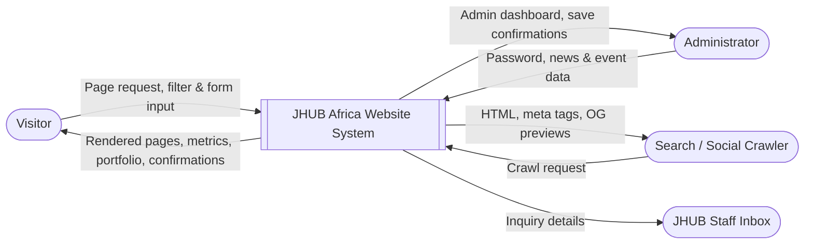
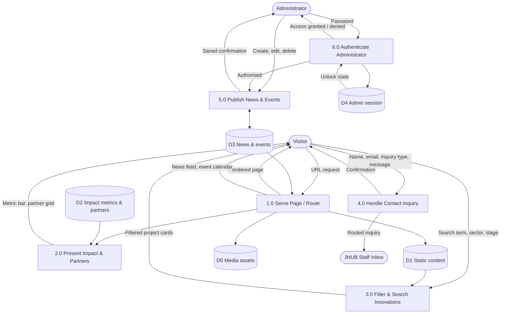
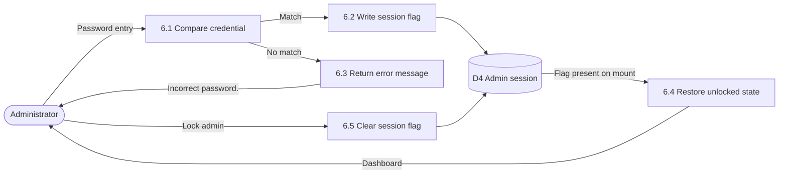
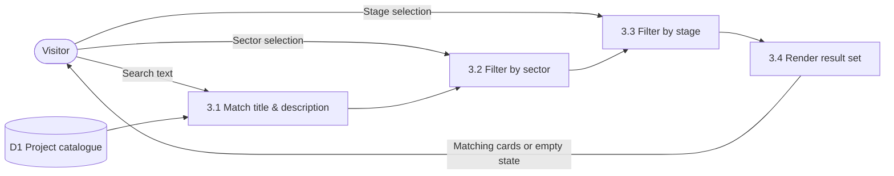
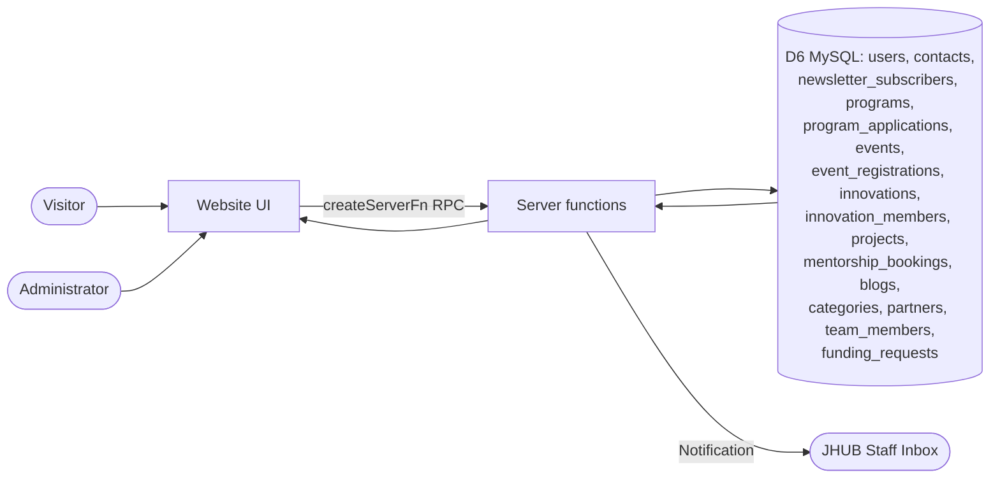

# JHUB Africa Website — Data Flow Diagrams (DFD)

Version 1.0 · Notation: Gane–Sarson style, rendered with Mermaid

## Entities, processes and stores

**External entities:** Visitor (innovator, student, funder, partner, researcher), Administrator, Search Engine / Social Crawler, Email Recipient (JHUB staff inbox).

**Data stores:**
| ID | Store | Implementation |
|---|---|---|
| D1 | Static content | Constants inside route files |
| D2 | Impact metrics & partners | `src/data/impact.ts` |
| D3 | News & events | `localStorage` via `src/lib/adminContent.ts` |
| D4 | Admin session | `sessionStorage` (`ADMIN_SESSION_KEY`) |
| D5 | Media assets | `src/assets/` (bundled, hashed) |
| D6 | JHUB database (planned) | MySQL, 16 tables |

---

## Level 0 — Context diagram



---

## Level 1 — Major processes



---

## Level 2 — Process 5.0: Publish News & Events

```mermaid
flowchart TB
  A([Administrator])
  P51[5.1 Verify unlock state]
  P52[5.2 Capture form input]
  P53[5.3 Validate required fields]
  P54[5.4 Create or update record]
  P55[5.5 Delete record after confirm]
  P56[5.6 Persist collection]
  P57[5.7 Render list & feedback]
  D3[(D3 News & events)]
  D4[(D4 Admin session)]

  A --> P51
  D4 --> P51
  P51 -->|Authorised| P52
  P52 --> P53
  P53 -->|Invalid: blocked| A
  P53 -->|Valid| P54
  A -->|Delete request| P55
  P54 --> P56
  P55 --> P56
  P56 --> D3
  D3 --> P57
  P57 -->|Updated list + "Saved."| A
  D3 -->|Feed data| V([Visitor via /news and /events])
```

---

## Level 2 — Process 6.0: Authenticate Administrator



---

## Level 2 — Process 3.0: Filter & Search Innovations



---

## Planned target-state flow (with MySQL backend)



### Migration notes
- D3 (`localStorage` news/events) is replaced by the `blogs` and `events` tables.
- D4 (client password flag) is replaced by the `users` table with hashed passwords and a server-side role check.
- Contact and funding submissions move from mailto/manual routing into `contacts` and `funding_requests`.
- Impact metrics and partners can move from D2 into the `partners` table while keeping a single approved source.
